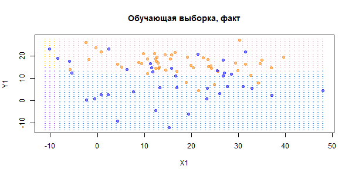
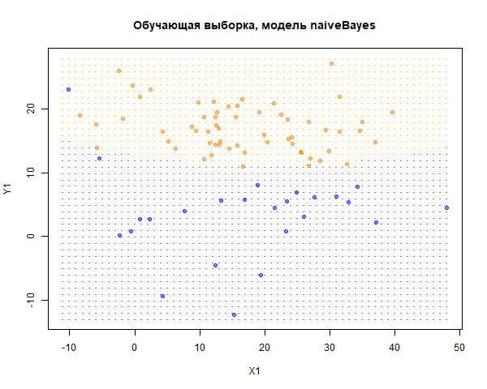
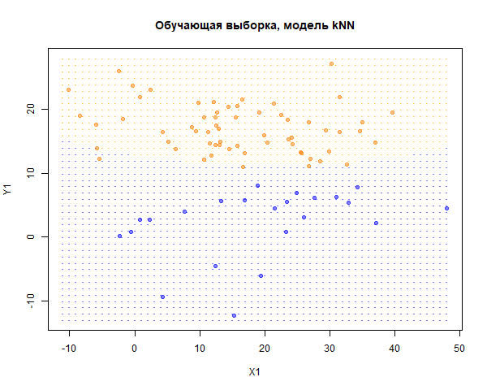

```{r setup, include=FALSE}
library('knitr')
library('class')          # функция knn()
library('e1071')          # функция naiveBayes()
library('MASS')           # функция mvrnorm()
library('emdbook')        # функция dmvnorm()
knitr::opts_chunk$set(echo = FALSE)
```

**Задача 1**

Построить модели на данных *примера 3* с параметрами распределений, соответствующими своему варианту. На графики нанести сетку истинных классов. Определить, какой из методов срабатывает на этих данных лучше, и почему.

Сгенерированы данные, непрерывно объясняющие переменные.

```{r}
# ядро
my.seed <- 27   

#координаты среднего Y=0
x1.mean.y0 <- 15          
x2.mean.y0 <- 9      
#ковариационная матрица объясняющих переменных Y=1
x1.sd.y0 <- 11    
x2.sd.y0 <- 8   

#аналогично для Y=1
x1.mean.y1 <- 16 
x2.mean.y1 <- 17  
x1.sd.y1 <- 10    
x2.sd.y1 <- 5   

mu1 <- c(x1.mean.y0, x2.mean.y0)
mu2 <- c(x1.mean.y1, x2.mean.y1)

n <- 100               # наблюдений всего
train.percent <- 0.85  # доля обучающей выборки

# x-ы -- двумерные нормальные случайные величины
set.seed(my.seed)
class.0 <- mvrnorm(45, mu = mu1, 
                   Sigma = matrix(c(x1.sd.y0^2, 0, 0, x2.sd.y0^2), 2, 2, byrow = T))

set.seed(my.seed + 1)
class.1 <- mvrnorm(55, mu = mu2, 
                   Sigma = matrix(c(x1.sd.y1^2, 0, 0, x2.sd.y1^2), 2, 2, byrow = T))

# записываем x-ы в единые векторы (объединяем классы 0 и 1)
x1 <- c(class.0[, 1], class.1[, 1])
x2 <- c(class.0[, 2], class.1[, 2])

# фактические классы Y
y <- c(rep(0, nrow(class.0)), rep(1, nrow(class.1)))

# классы для наблюдений сетки
rules.mv <- function(v.x, v.mean.y0, v.mean.y1, m.sigma.y0, m.sigma.y1){
  ifelse(dmvnorm(v.x, v.mean.y0, m.sigma.y0) > 
           dmvnorm(v.x, v.mean.y1, m.sigma.y1), 0, 1)
  
}
```

- n = `r n`, доля обучающей выборки: `r train.percent*100`%

- класс $$Y=0: X \sim N((15, 9),\begin{pmatrix} 11^2 &0\\0&8^2\end{pmatrix})$$

- класс $$Y=1: X \sim N((16, 17),\begin{pmatrix} 10^2 &0\\0&5^2\end{pmatrix})$$

```{r}
# Отбираем наблюдения в обучающую выборку --------------------------------------
set.seed(my.seed)
inTrain <- sample(seq_along(x1), train.percent * n)
x1.train <- x1[inTrain]
x2.train <- x2[inTrain]
x1.test <- x1[-inTrain]
x2.test <- x2[-inTrain]

# используем истинные правила, чтобы присвоить фактические классы
y.train <- y[inTrain]
y.test <- y[-inTrain]

# фрейм с обучающей выборкой
df.train.1 <- data.frame(x1 = x1.train, x2 = x2.train, y = y.train)
# фрейм с тестовой выборкой
df.test.1 <- data.frame(x1 = x1.test, x2 = x2.test)
```

Нарисуем обучающую выборку на графике. Сеткой точек показаны области классов, соответствующие истинным дискриминирующим правилам. Это правило создаём, зная истинные законы распределения классов, как максимум из двух плотностей распределения (плотность многомерного закона считаем функцией *dmvnorm()*, классы точкам сетки присваиваем пользовательской функцией *rules.mv()*).

```{r, results="hide"}
# Рисуем обучающую выборку графике ---------------------------------------------
png("plot2_1.png", width = 600, height = 300)
# для сетки (истинных областей классов): целочисленные значения x1, x2
x1.grid <- rep(seq(floor(min(x1)), ceiling(max(x1)), by = 1),
               ceiling(max(x2)) - floor(min(x2)) + 1)
x2.grid <- rep(seq(floor(min(x2)), ceiling(max(x2)), by = 1),
               each = ceiling(max(x1)) - floor(min(x1)) + 1)

# классы для наблюдений сетки
y.grid <- rules.mv(as.matrix(cbind(x1.grid, x2.grid)),
                   mu1, mu2, 
                   matrix(c(x1.sd.y0^2, 0, 0, x2.sd.y0^2), 2, 2, byrow = T),
                   matrix(c(x1.sd.y1^2, 0, 0, x2.sd.y1^2), 2, 2, byrow = T))

# фрейм для сетки
df.grid.1 <- data.frame(x1 = x1.grid, x2 = x2.grid, y = y.grid)

# цвета для графиков
cls <- c('blue', 'orange')
cls.t <- c(rgb(0, 0, 1, alpha = 0.5), rgb(1,0.5,0, alpha = 0.5))

# график истинных классов
plot(df.grid.1$x1, df.grid.1$x2, 
     pch = '·', col = cls[df.grid.1[, 'y'] + 1],
     xlab = 'X1', ylab = 'Y1',
     main = 'Обучающая выборка, факт')
# точки фактических наблюдений
points(df.train.1$x1, df.train.1$x2,
       pch = 21, bg = cls.t[df.train.1[, 'y'] + 1], 
       col = cls.t[df.train.1[, 'y'] + 1])
dev.off()
```



Обучим модель наивного байесовского классификатора и оценим её точность (верность) на обучающей выборке. Поскольку объясняющие переменные для классов сгенерированы как двумерные нормальные распределения и сами классы не перекрываются, следует ожидать, что эта модель окажется точной.


```{r, results="hide"}
# Байесовский классификатор ----------------------------------------------------
#  наивный байес: непрерывные объясняющие переменные
png("plot2_2.png", width = 600)
# строим модель
nb <- naiveBayes(y ~ ., data = df.train.1)
# получаем модельные значения на обучающей выборке как классы
y.nb.train <- ifelse(predict(nb, df.train.1[, -3], 
                             type = "raw")[, 2] > 0.5, 1, 0)

# график истинных классов
plot(df.grid.1$x1, df.grid.1$x2, 
     pch = '·',  col = cls[df.grid.1[, 'y'] + 1], 
     xlab = 'X1', ylab = 'Y1',
     main = 'Обучающая выборка, модель naiveBayes')
# точки наблюдений, предсказанных по модели
points(df.train.1$x1, df.train.1$x2, 
       pch = 21, bg = cls.t[y.nb.train + 1], 
       col = cls.t[y.nb.train + 1])
dev.off()
```



Матрица неточностей на обучающей выборке:

```{r}
# матрица неточностей на обучающей выборке
tbl0 <- table(y.train, y.nb.train)
kable(tbl0)

```

```{r, results="hide"}
# точность, или верность (Accuracy)
Acc <- sum(diag(tbl0)) / sum(tbl0)
Acc
```

Точность на обучающей выборке близка к высокой = `r Acc`. Сделаем прогноз классов Y на тестовую выборку и оценим точность модели.

```{r}
# прогноз на тестовую выборку
y.nb.test <- ifelse(predict(nb, df.test.1, type = "raw")[, 2] > 0.5, 1, 0)

# матрица неточностей на тестовой выборке
tbl1 <- table(y.test, y.nb.test)
kable(tbl1)
```
```{r, results="hide"}
# точность, или верность (Accuracy)
Acc <- sum(diag(tbl1)) / sum(tbl1)
Acc
```

Наивный байесовский метод разделяет классы на обучающей выборке, но с ошибкой в 1 наблюдении среди тестовых, от этого её точность равна `r Acc`.

Построим модель kNN (метод ближайшего соседа). С этими данными у метода не должно возникнуть проблем, так как он не проводит чёткой границы между классами, а в каждом случае ориентируется на соседние наблюдения.

```{r, results="hide"}
# Метод kNN --------------------------------------------------------------------
#  k = 3
png("plot2_3.png", width = 600)

# строим модель и делаем прогноз
y.knn.train <- knn(train = scale(df.train.1[, -3]), 
                   test = scale(df.train.1[, -3]),
                   cl = df.train.1$y, k = 9)

# график истинных классов
plot(df.grid.1$x1, df.grid.1$x2, 
     pch = '·', col = cls[df.grid.1[, 'y'] + 1],
     xlab = 'X1', ylab = 'Y1',
     main = 'Обучающая выборка, модель kNN')
# точки наблюдений, предсказанных по модели
points(df.train.1$x1, df.train.1$x2, 
       pch = 21, bg = cls.t[as.numeric(y.knn.train)], 
       col = cls.t[as.numeric(y.knn.train)])
dev.off()
```



Матрица неточностей на обучающей выборке: 

```{r}
# матрица неточностей на обучающей выборке
tbl <- table(y.train, y.knn.train)
kable(tbl)
```

```{r, results="hide"}
# точность (Accuracy)
Acc <- sum(diag(tbl)) / sum(tbl)
Acc
```

Точность на обучающей выборке ниже, чем в Байесовском методе и равна (`r Acc`).
Оценка точности на тестовой выборке также показывает, что модель классифицирует аналогично прошлому методу: найдутся значения (3), что находятся близко к границе чужого класса.

```{r}
# прогноз на тестовую выборку
y.knn.test <- knn(train = scale(df.train.1[, -3]), 
                 test = scale(df.test.1[, -3]),
                 cl = df.train.1$y, k = 3)

# матрица неточностей на тестовой выборке
tbl <- table(y.test, y.knn.test)
kable(tbl)
```

```{r, results="hide"}
# точность (Accuracy)
Acc <- sum(diag(tbl)) / sum(tbl)
Acc
```

***

**Вывод**: Высокая точность не является гарантией качества модели. Выберем метод наивного Байеса для дальнейших расчётов характеристик качества, так как ошибок в тестовой выборке там меньше и точность выше.

***


**Задача 2**

По матрице неточностей той модели, которая оказалась лучше по Acc, рассчитать характеристики качества и ошибки из лекции: TPR, SPC, PPV, NPV, FNR, FPR, FDR, MCC.

Матрица неточностей:

$$ 
M = \begin{matrix}
  ~ & H_0 & H_1 \\ 
  H_0 & |TN & FP| \\
  H_1 & |FN & TP| 
 \end{matrix}
$$


Чувствительность (sensitivity, TP rate, recall):

$$TPR=P(модель:+|факт:+)=\frac{TP}{(TP+FN)}$$

Специфичность (specificity, TN rate):

$$SPC=P(модель:-|факт:-)=\frac{TN}{(TN+FP)}$$

Ценность положительного прогноза (positive predictive value, precision):

$$PPV=P(модель:+|факт:+)=\frac{TP}{(TP+FP)}$$

Ценность отрицательного прогноза (negative predictive value):

$$NPV=P(модель:-|факт:-)=\frac{TN}{(TN+FN)}$$

*Ошибки (чем ниже, тем лучше):*

- Доля ложноотрицательных исходов (FN rate):

$$FNR=1-TPR$$

- Доля ложных срабатываний (fall-out rate, FP rate):

$$FPR=1-SPC$$

- Доля ложного обнаружения (false discovery rate):

$$FDR=1-PPV$$

Корреляция Мэтьюса:

$$MCC=\frac{TP\cdot TN-FP\cdot FN}{\sqrt{(TP+FP)(TP+FN)(TN+FP)(TN+FN)}}$$

```{r}
#для обучающей выборки
TPR0 <- tbl0[4]/(tbl0[4] + tbl0[2])
SPC0 <- tbl0[1]/(tbl0[1] + tbl0[3])
PPV0 <- tbl0[4]/(tbl0[4] + tbl0[3])
NPV0 <- tbl0[1]/(tbl0[1] + tbl0[2])
FNR0 <- 1 - TPR0
FPR0 <- 1 - SPC0
FDR0 <- 1 - PPV0
MMC0 <- (tbl0[4]*tbl0[1] - tbl0[2]*tbl0[3])/sqrt((tbl0[4] + tbl0[3])*(tbl0[4] + tbl0[2]) *
            (tbl0[1] + tbl0[3])*(tbl0[1] + tbl0[2]))
fit0 <- c(TPR0, SPC0,PPV0, NPV0, FNR0, FPR0, FDR0, MMC0)
#для тестовой выборки
TPR1 <- tbl1[4]/(tbl1[4] + tbl1[2])
SPC1 <- tbl1[1]/(tbl1[1] + tbl1[3])
PPV1 <- tbl1[4]/(tbl1[4] + tbl1[3])
NPV1 <- tbl1[1]/(tbl1[1] + tbl1[2])
FNR1 <- 1 - TPR1
FPR1 <- 1 - SPC1
FDR1 <- 1 - PPV1
MMC1 <- (tbl1[4]*tbl1[1] - tbl1[2]*tbl1[3])/sqrt((tbl1[4] + tbl1[3])*(tbl1[4] + tbl1[2]) *
                                                 (tbl1[1] + tbl1[3])*(tbl1[1] + tbl1[2]))
fit1 <- c(TPR1, SPC1,PPV1, NPV1, FNR1, FPR1, FDR1, MMC1)
```

Построим таблицу со всеми характеристиками качества для обучающей и тестовой выборок.

```{r}
df.models <- data.frame(fit0 , fit1, row.names = c('TPR', 'SPC', 'PPV', 'NPV', 'FNR', 'FPR', 'FDR', 'MMC'),stringsAsFactors = FALSE)
names(df.models) <- c('Обучающая', 'Тестовая')
kable(round(df.models, 3))
```

***

Вывод: Таким образом, характеристики качества TPR, SPC, PPV, NPV и MMC желательно должны быть приближены к единице, в то время как ошибки - быть минимальными. По тестовой выборке мы можем увидеть, что она хорошо описывает обучающую выборку и в большинстве ей соответствует.

***


